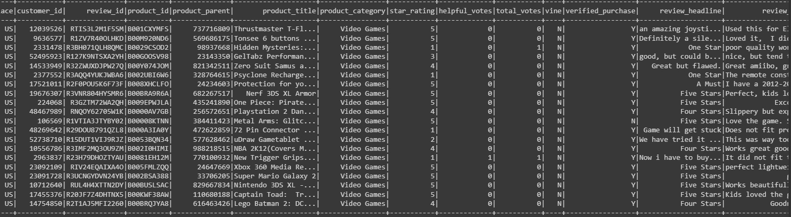
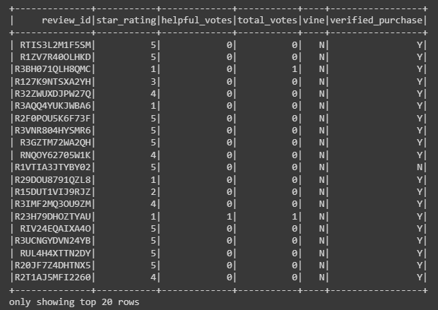

# Amazon_Vine_Analysis

## Overview

The objective of this analysis is to analyze the Amazon reviews written by members of the Amazon Vine program. The Amazon Vine program is a service that allows sellers to receive reviews for their products that they ship to Vine members. Since there are dozens of categories, and hundreds of thousands reviews, I focused specifically on one category, Video Games. Once the dataset was selected, I would need to use PySpark and perform ETL to make reading and analyzing the data easier. It would need to be extracted and transformed from tsv on the web to an AWS RDS and then loaded into tables in the postgres SQL database.

## Results

There was a large skew between the number paid Vine reviews and unpaid:
* The total number of paid Vine reviews is 90
* The total number of unpaid Vine reviews is 37385
* The total number of 5-star paid Vine reviews is 44
* The total number of 5-star unpaid Vine reviews is 14626
* The percent of 5-star paid Vine reviews is 48
* The percent of 5-star unpaid Vine reviews is 39

### Datasets
The full dataset for the Video Game Vine reviews looks like this:

Paid vine dataset

Unpaid Vine dataset

## Summary
